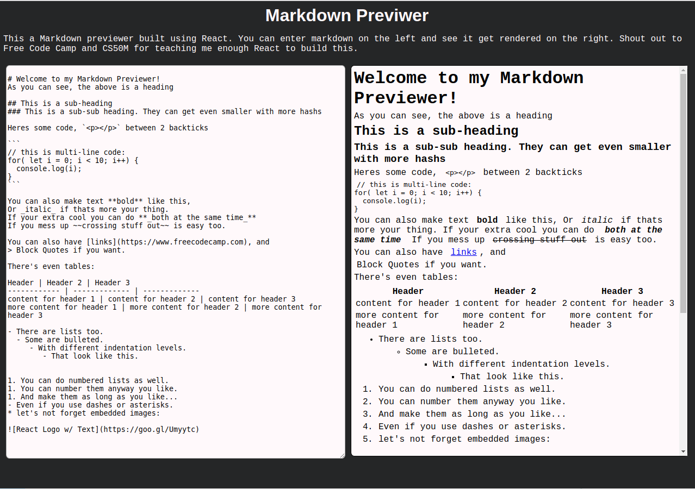

# markdown-previewer
A React application that allows a user to write markdown and see it get rendered live.

## installation

1. run `npm install` to get dependencies
2. run `npm start` to run the server
3. go to `localhost:3000` on your browser to see the app

## usage

The box on the left is the markdown editor and can be used to write your markdown code. The box on the right is the markdown renderer and will display any markdown you have written. Note that that the editor can be resized by dragging its lower right corner.

